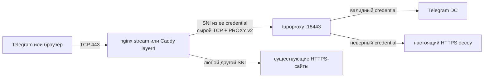

<p align="center">
  
</p>

<h1 align="center">tupoproxy</h1>

<p align="center">
  MTProto-прокси с FakeTLS, выбираемыми серверными TLS-профилями<br>
  и безопасным совместным использованием HTTPS-порта с nginx или Caddy.
</p>

<p align="center">
  <a href="#быстрый-старт">Быстрый старт</a> ·
  <a href="#как-устроен-общий-tls-порт">Архитектура</a> ·
  <a href="#диагностика">Диагностика</a> ·
  <a href="docs/DPI_THREAT_MODEL.md">Модель угроз</a>
</p>

<p align="center">
  
  
  
  
</p>

> [!IMPORTANT]
> Ни один прокси не может гарантировать обход любых настоящих и будущих
> блокировок. Блокировка IP-адреса, разрешительный список провайдера, правила
> VPN или клиента находятся вне контроля сервера. tupoproxy уменьшает
> количество протокольных отличий и предоставляет настоящий HTTPS fallback,
> но не заявляет о полной невидимости для любого DPI.

## Главное

| Возможность | Реализация |
|---|---|
| Совместимая Telegram-ссылка | Credential имеет стандартный вид `ee + secret + hex(SNI)` |
| FakeTLS без конфликта с reverse proxy | Edge читает только SNI и передаёт исходный TCP-поток без TLS-терминации |
| Общий HTTPS-порт | Существующие сайты продолжают работать на том же nginx/Caddy |
| Защита от активной проверки | Неверный credential получает ответ настоящего HTTPS decoy |
| TLS-профили | `chrome`, `firefox`, `compat` и `legacy` выбираются при установке |
| Сохранение адреса клиента | Между edge и tupoproxy используется PROXY protocol v2 |
| Docker | Поддерживаются nginx/Caddy с постоянным bind/volume-конфигом |
| Чистое удаление | Маршрут удаляется, а изменённые nginx-listen директивы восстанавливаются |

## Как устроен общий TLS-порт



Reverse proxy не расшифровывает FakeTLS-маршрут. Он считывает SNI из
ClientHello, добавляет PROXY v2 и передаёт все исходные TLS-байты tupoproxy.
Это принципиально отличается от HTTP `reverse_proxy`: обычная TLS-терминация
на маршруте decoy разрушила бы MTProxy credential.

Для остальных SNI поведение не меняется:

- в Caddy обработка переходит к стандартному TLS listener wrapper;
- в nginx прежние HTTPS listeners переносятся на локальный порт, а `stream`
  возвращает им обычный веб-трафик;
- порт `80`, ACME-настройки и другие TCP/UDP-порты не изменяются.

Реализация следует документации
[caddy-l4 listener wrappers](https://github.com/mholt/caddy-l4/blob/master/docs/servers.md)
и
[nginx ssl_preread](https://nginx.org/en/docs/stream/ngx_stream_ssl_preread_module.html).

## Быстрый старт

### Что потребуется

- Debian 12+ или Ubuntu 22.04+;
- `root` либо `sudo`;
- origin-домен прокси с корректной `A`/`AAAA` записью;
- отдельный FakeTLS decoy-домен;
- доступный публичный TCP/443;
- существующий совместимый nginx/Caddy либо возможность установить Docker.

Decoy может располагаться на другом сервере. Если оба домена указывают на
один VPS, установщик выпускает отдельный сертификат decoy и поднимает его на
изолированном loopback-порту. Когда публичный edge использует `443`, для
локального decoy автоматически выбирается свободный `3443`, `4443`, `5443`
или `6443`.

### Одна команда

Под `root`:

```bash
curl -fL https://github.com/wasteprince/tupoproxy/releases/latest/download/install.sh | bash
```

С `sudo`:

```bash
curl -fL https://github.com/wasteprince/tupoproxy/releases/latest/download/install.sh | sudo bash
```

Мастер спросит только домены, TLS-профиль и имя credential. Публичный порт
всегда `443`, а служебный loopback-порт decoy выбирается автоматически.
E-mail Let's Encrypt запрашивается только тогда, когда same-server decoy
действительно нуждается в сертификате.

Затем установщик автоматически:

1. Установит системные зависимости.
2. Скачает статический `amd64`/`arm64` бинарник и проверит SHA-256.
3. Найдёт reverse proxy, который сейчас владеет TCP/443.
4. Запишет конфигурацию tupoproxy и systemd units.
5. Добавит сырой L4-маршрут FakeTLS, проверит конфиг и перезагрузит edge.
6. Проверит origin HTTPS и scanner-visible fallback decoy.
7. Покажет secret для `@MTProxybot` и готовую `tg://proxy`-ссылку.

Результат сохраняется с правами `0600`:

```text
/etc/tupoproxy/INSTALLATION.txt
```

### Что происходит с существующим reverse proxy

| Найденный edge | Действие установщика |
|---|---|
| Host nginx со `stream_ssl_preread` | Изменяет активные конфиги, выполняет `nginx -t`, затем reload |
| Docker nginx со `stream_ssl_preread` | Изменяет активный конфиг в постоянном mount, проверяет и reload |
| Host Caddy с caddy-l4 | Добавляет listener wrapper в используемый Caddyfile, затем validate/reload |
| Docker Caddy с caddy-l4 | Изменяет Caddyfile в постоянном mount, затем validate/reload |
| Docker Caddy без caddy-l4 | Сохраняет бинарник, добавляет caddy-l4 штатной командой Caddy и перезапускает тот же контейнер |
| Порт 443 свободен | Создаёт управляемый Docker Caddy с caddy-l4 в `/opt/caddy` |
| Порт занят несовместимым процессом | Останавливается с диагностикой и ничего не заменяет |

Установщик изменяет именно текущий основной конфиг, а не создаёт неактивный
фрагмент рядом. Блоки отмечены `BEGIN/END TUPOPROXY EDGE`. Перед reload всегда
выполняется штатная проверка. Если проверка или reload завершается ошибкой,
все изменения текущего запуска откатываются.

> [!NOTE]
> Обычная сборка Caddy без caddy-l4 не умеет прочитать SNI и одновременно
> передать нетронутый FakeTLS поток. Для Docker Caddy установщик использует
> штатный `caddy add-package`, сохраняет исходный бинарник и восстанавливает
> его при удалении tupoproxy. После recreation такого контейнера установку
> нужно повторить, потому что Docker удаляет его writable layer.

### Docker

Docker-контейнер поддерживается независимо от имени и каталога запуска, если:

- контейнер публикует TCP/443 или работает с host networking;
- nginx собран с `stream_ssl_preread_module`; для Caddy недостающий caddy-l4
  может быть установлен автоматически;
- основной конфиг и изменяемые include-файлы находятся в bind mount или
  named volume.

Bind mount или named volume может быть подключён в контейнер только для
чтения: установщик определяет его исходный путь на хосте и обновляет именно
существующий файл, не меняя режим mount и соседние файлы. После проверки
конфигурации он перезагружает тот же reverse proxy; при ошибке возвращает
исходное содержимое.

Конфиг, хранящийся только во writable layer контейнера, намеренно не
изменяется: после `docker compose up --force-recreate` такое изменение
исчезло бы. В этом случае вынесите конфигурацию в постоянный volume и повторите
установку.

Если edge отсутствует и `443` свободен, создаётся:

```text
/opt/caddy/
├── Caddyfile
├── Dockerfile
├── config/
└── data/
```

Контейнер имеет ownership label tupoproxy. Скрипты установки и удаления не
перезаписывают чужую папку `/opt/caddy` или контейнер с совпавшим именем без
этого маркера.

## FakeTLS credential и `@MTProxybot`

Рабочая ссылка остаётся TLS-ссылкой:

```text
tg://proxy?server=proxy.example.com&port=443&secret=ee<32-hex-secret><hex-decoy-sni>
```

Когда `@MTProxybot` пишет:

```text
Now please specify its secret in hex format.
```

отправьте только базовый 32-символьный secret, который отдельно покажет
установщик. Не добавляйте `ee` и hex-домен. После регистрации можно вставить
выданный ботом 32-hex `ad_tag` прямо в мастер установки.

FakeTLS в ссылке не конфликтует с reverse proxy: edge не завершает TLS для
decoy SNI и не создаёт второй ClientHello.

## Неинтерактивная установка

```bash
curl -fL https://github.com/wasteprince/tupoproxy/releases/latest/download/install.sh \
  | sudo bash -s -- \
      --domain proxy.example.com \
      --tls-domain decoy.example.org \
      --profile chrome \
      --user user
```

Для same-server decoy добавьте `--email admin@example.com`. При занятом
порту `80` используйте DNS-01:

```bash
sudo env TUPOPROXY_CLOUDFLARE_API_TOKEN='TOKEN' bash install.sh \
  --domain proxy.example.com \
  --tls-domain decoy.example.org \
  --email admin@example.com \
  --acme-mode dns \
  --dns-provider cloudflare
```

Можно передать уже существующий сертификат локального decoy:

```bash
sudo bash install.sh \
  --domain proxy.example.com \
  --tls-domain decoy.example.org \
  --tls-cert-fullchain /etc/letsencrypt/live/decoy.example.org/fullchain.pem \
  --tls-cert-key /etc/letsencrypt/live/decoy.example.org/privkey.pem
```

Origin-сертификатом продолжает управлять существующий nginx/Caddy. В
автоматически созданном `/opt/caddy` сертификат origin получает сам Caddy.

### Порты

Публичный endpoint всегда использует TCP/443, поэтому мастер не предлагает
выбор порта и Telegram-ссылка всегда содержит `port=443`. Если decoy находится
на этом же VPS, его непубличный loopback-порт выбирается автоматически из
`3443`, `4443`, `5443` и `6443`.

## TLS-профили

| Профиль | Назначение |
|---|---|
| `chrome` | Основной современный серверный профиль |
| `firefox` | Альтернативные TLS-record фазы и размеры |
| `compat` | Более консервативная форма для туннелей с уменьшенным MTU |
| `legacy` | Совместимость с прежним фиксированным поведением |

Профиль влияет только на доступную серверу сторону обмена. ClientHello,
JA3/JA4 и TCP/IP-параметры телефона создаются Telegram и операционной
системой; сервер не способен безопасно переписать их задним числом.

## Работа вместе с VPN

tupoproxy использует обычный TCP. Если VPN направляет трафик Telegram в
туннель, соединение с прокси обычно проходит внутри него. Сервер не может
отменить клиентский kill switch, split tunneling, Private DNS или запрет
локальной сети в приложении VPN.

Если прокси работает только в одном из двух режимов, сравните:

- разрешение origin-домена и IP в обеих сетях;
- доступность TCP/443;
- правила split tunneling для Telegram;
- наличие `AAAA`, если сервер фактически не принимает IPv6;
- SNI и сертификат scanner-visible decoy.

Принудительное дробление TCP-пакетов не является надёжной основной защитой:
DPI может собрать байтовый поток обратно. Поэтому edge сохраняет ClientHello
без изменений, а tupoproxy использует адаптивные границы TLS records на своей
стороне соединения.

## Управление

```bash
systemctl status tupoproxy --no-pager
journalctl -u tupoproxy -f
sudo -u tupoproxy /usr/local/bin/tupoproxy \
  healthcheck /etc/tupoproxy/config.toml --mode ready
```

Повторный запуск однострочного установщика обновляет бинарник, сохраняет
secret и заново применяет управляемый reverse-proxy маршрут.

### Полное удаление

```bash
curl -fL https://github.com/wasteprince/tupoproxy/releases/latest/download/uninstall.sh \
  | sudo bash
```

Удаление восстанавливает прежние nginx listeners или удаляет блок Caddy,
перезагружает существующий edge, останавливает сервисы и удаляет приватные
данные tupoproxy. Сам reverse proxy не удаляется: созданный контейнер Caddy,
`/opt/caddy`, его сайт, Docker и firewall-правила сохраняются. Чужие сайты,
общие пакеты и сертификаты также не затрагиваются.

Удалить также сертификат локального decoy, выпущенный установщиком:

```bash
curl -fL https://github.com/wasteprince/tupoproxy/releases/latest/download/uninstall.sh \
  | sudo bash -s -- --purge-certificate
```

Для удаления без подтверждения добавьте `--yes`.

## Диагностика

### Проверка двух SNI-маршрутов

```bash
openssl s_client -connect SERVER_IP:443 \
  -servername proxy.example.com -alpn h2 </dev/null

openssl s_client -connect SERVER_IP:443 \
  -servername decoy.example.org -alpn h2 </dev/null
```

Первый запрос должен показать origin-сертификат существующего сайта. Второй
попадает в tupoproxy как неверный credential и должен вернуть сертификат
настоящего decoy.

### Полезные файлы и команды

| Назначение | Путь или команда |
|---|---|
| Конфигурация | `/etc/tupoproxy/config.toml` |
| Итог установки и ссылка | `/etc/tupoproxy/INSTALLATION.txt` |
| Метаданные отката edge | `/var/lib/tupoproxy/edge-integration.json` |
| Логи tupoproxy | `journalctl -u tupoproxy -n 100 --no-pager` |
| Управляемый Caddy | `docker logs --tail 100 tupoproxy-caddy` |
| Проверка nginx | `nginx -t` |
| Проверка Caddy | `caddy validate --config /path/to/Caddyfile` |

### Типовые ошибки

| Сообщение | Что означает |
|---|---|
| `owned by an incompatible service` | TCP/443 занят host Caddy без caddy-l4, несовместимым nginx либо неизвестным контейнером; следующая строка показывает точного владельца |
| `configuration is not stored in a persistent mount` | Docker-конфиг исчез бы после recreation; подключите bind/volume |
| `custom stream context` | В nginx уже есть ручная L4-схема, которую нельзя безопасно объединить автоматически |
| `listener_wrappers already contain layer4` | В Caddy уже есть ручные L4-правила; объедините маршруты вручную |
| `FakeTLS decoy fallback failed` | Неверный ClientHello не получил доверенный сертификат decoy |
| Работает только через VPN | Проверяйте DNS/AAAA, маршрут провайдера, доступность порта и блокировку IP |

## Сборка и бинарники

Установить только готовый статический бинарник:

```bash
curl -fL https://github.com/wasteprince/tupoproxy/releases/latest/download/install.sh \
  | sudo bash -s -- --binary-only
tupoproxy --version
```

Релизы собираются для `x86_64-unknown-linux-musl` и
`aarch64-unknown-linux-musl`, поэтому соответствующий бинарник работает и в
Debian, и в Ubuntu.

Сборка текущей версии из исходников:

```bash
git clone https://github.com/wasteprince/tupoproxy.git
cd tupoproxy
./install-source.sh
```

## Безопасность и лицензия

Не публикуйте `/etc/tupoproxy/config.toml` и `INSTALLATION.txt`: они содержат
secret и могут содержать рекламный tag. О найденной уязвимости сообщайте
приватно владельцу репозитория, не прикладывая рабочие credentials.

Условия распространения находятся в [LICENSE](LICENSE) и
[LICENSING.md](LICENSING.md).
