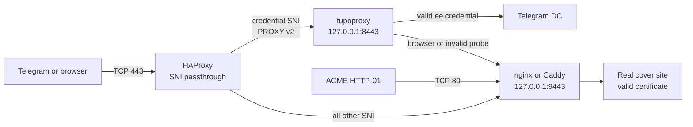

<p align="center">
  
</p>

<h1 align="center">tupoproxy</h1>

<p align="center">
  An MTProto proxy with selectable TLS camouflage profiles,<br>
  adaptive downstream record shaping, real HTTPS fallback, and a deployment<br>
  layout designed to coexist with existing sites and ACME.
</p>

<p align="center">
  <a href="README.ru.md"><strong>Русская версия</strong></a>
  ·
  <a href="#quick-start">Quick start</a>
  ·
  <a href="deploy/README.md">Production layout</a>
  ·
  <a href="docs/DPI_THREAT_MODEL.md">DPI threat model</a>
</p>

<p align="center">
  
  
  
  
</p>

> [!IMPORTANT]
> tupoproxy improves the parts of FakeTLS that a server can control. Telegram
> creates the inbound ClientHello, so the proxy cannot rewrite the app's
> client-side JA3/JA4 fingerprint. Stateful DPI can also reassemble TCP
> segments. No proxy can guarantee access through every future block, IP ban,
> VPN policy, or allow-list.

## What it adds

| Capability | What tupoproxy does |
|---|---|
| Standard Telegram links | Keeps the compatible `ee + secret + hex(SNI)` credential format |
| Selectable TLS profile | Maps a credential SNI to `chrome`, `firefox`, `compat`, or `legacy` |
| Real TLS material | Fetches the selected domain's live TLS behavior and validates cached profile metadata |
| Downstream traffic shape | Varies application-data TLS record boundaries with per-connection server entropy |
| Probe handling | Sends invalid authentication to a real HTTPS cover endpoint instead of a proxy banner |
| Shared public port | Uses HAProxy SNI passthrough so existing HTTPS sites keep working on the same IP |
| Certificate renewal | Leaves port 80 and certificate ownership with the existing web server/ACME client |
| VPN coexistence | Uses ordinary TCP/443 and avoids server-side source-network restrictions by default |
| Optional Xray leg | Can route the server-to-Telegram connection through a local SOCKS listener |

## How the recommended layout works



HAProxy only inspects enough of the ClientHello to route by SNI; it does not
terminate TLS. tupoproxy receives the original byte stream. Existing web
projects remain behind nginx/Caddy on loopback port `9443`, while ACME keeps
using public port `80`.

## Quick start

### 1. Download the source

```bash
git clone https://github.com/wasteprince/tupoproxy.git
cd tupoproxy
```

To update an existing checkout later:

```bash
git pull --ff-only
./install.sh
```

### 2. Install build dependencies

Debian or Ubuntu:

```bash
sudo apt update
sudo apt install -y git curl build-essential pkg-config ca-certificates openssl
```

Install the stable Rust toolchain if `cargo` is not already available:

```bash
curl --proto '=https' --tlsv1.2 -sSf https://sh.rustup.rs | sh
. "$HOME/.cargo/env"
```

### 3. Build and install the local fork

```bash
./install.sh
tupoproxy --version
```

The script builds this checkout with `cargo --locked` and installs only
`/usr/local/bin/tupoproxy`. It never downloads or substitutes an upstream
binary.

### 4. Choose a deployment

- For an own domain, valid certificate, existing sites, and uninterrupted
  ACME, follow the [recommended production setup](#production-setup-own-domain--shared-https).
- For a disposable direct-port test, copy `config.toml`, replace the placeholder
  domain and zero secret, then run `tupoproxy ./config.toml`.
- For a container build, see [Docker](#docker).

## Production setup: own domain + shared HTTPS

The following example assumes Debian/Ubuntu, nginx, systemd, and these names:

| Purpose | Example to replace |
|---|---|
| Public host/link | `proxy.example.com` |
| Chrome credential SNI | `chrome.proxy.example.com` |
| Firefox credential SNI | `firefox.proxy.example.com` |
| Public proxy port | `443` |
| Internal tupoproxy port | `127.0.0.1:8443` |
| Internal real HTTPS cover | `127.0.0.1:9443` |

Create `A` and, when used, `AAAA` records for all three hostnames. They should
point to the same server. Do not continue until DNS resolves correctly.

### Install the edge components

```bash
sudo apt install -y haproxy nginx certbot
sudo install -d -m 0755 /var/www/acme /var/www/tupoproxy-cover
```

Your existing port-80 virtual host must serve
`/.well-known/acme-challenge/` from `/var/www/acme`. Then request the real
certificate before enabling the TLS cover block:

```bash
sudo certbot certonly --webroot -w /var/www/acme \
  -d chrome.proxy.example.com \
  -d firefox.proxy.example.com
```

Adapt [the nginx example](deploy/nginx-cover.conf.example) to the certificate
path produced by Certbot. Move existing public `listen 443 ssl` virtual hosts
to loopback `127.0.0.1:9443`; do not blindly overwrite a working nginx config.

### Prepare tupoproxy

Create a service account and install the example configuration:

```bash
sudo useradd --system --home /var/lib/tupoproxy \
  --shell /usr/sbin/nologin tupoproxy 2>/dev/null || true
sudo install -d -o tupoproxy -g tupoproxy -m 0750 /var/lib/tupoproxy
sudo install -d -m 0750 /etc/tupoproxy
sudo install -m 0640 -o root -g tupoproxy \
  deploy/tupoproxy.toml.example /etc/tupoproxy/config.toml
openssl rand -hex 16
```

Edit `/etc/tupoproxy/config.toml` and replace every `example.com` value and the
all-zero example secret. The secret must contain exactly 32 hexadecimal
characters. The production example already:

- listens only on `127.0.0.1:8443`;
- trusts PROXY v2 only from loopback;
- sends invalid traffic to the real TLS endpoint on `127.0.0.1:9443`;
- enables TLS emulation and per-SNI profile selection;
- binds the management API only to loopback.

Install and start the hardened systemd service:

```bash
sudo install -m 0644 deploy/tupoproxy.service.example \
  /etc/systemd/system/tupoproxy.service
sudo systemctl daemon-reload
sudo systemctl enable --now tupoproxy
sudo systemctl status tupoproxy --no-pager
```

### Put HAProxy on public port 443

Merge [the HAProxy example](deploy/haproxy.cfg.example) into the active HAProxy
configuration and replace both credential hostnames. First validate nginx and
HAProxy, then switch public port `443` from nginx to HAProxy:

```bash
sudo nginx -t
sudo haproxy -c -f /etc/haproxy/haproxy.cfg
sudo systemctl reload nginx
sudo systemctl enable --now haproxy
```

If nginx still owns `0.0.0.0:443` or `[::]:443`, HAProxy cannot start. Only the
loopback TLS listener should remain in nginx after the migration.

### Verify before sharing a link

```bash
sudo -u tupoproxy /usr/local/bin/tupoproxy \
  healthcheck /etc/tupoproxy/config.toml --mode ready

openssl s_client -connect SERVER_IP:443 \
  -servername chrome.proxy.example.com </dev/null

curl --resolve chrome.proxy.example.com:443:SERVER_IP \
  https://chrome.proxy.example.com/

sudo journalctl -u tupoproxy -n 100 --no-pager
```

The browser request must show the real cover certificate/site. The logs print
Telegram links for users selected by `[general.links]`.

## TLS profile selection

```toml
[censorship]
tls_domain = "chrome.proxy.example.com"
tls_fingerprints = {
  "chrome.proxy.example.com" = "chrome",
  "firefox.proxy.example.com" = "firefox",
  "safe.proxy.example.com" = "compat"
}
```

| Profile | Intended use |
|---|---|
| `chrome` | Default modern profile and Chrome-like downstream record phases |
| `firefox` | Firefox-oriented TLS fetch and a distinct downstream shape |
| `compat` | Conservative sizes for paths with proxies, VPNs, or smaller MTU |
| `legacy` | Original fixed large-record behavior for compatibility testing |

Each map key becomes a valid credential SNI. The link remains standard:

```text
ee + 16-byte-secret + hex(SNI)
```

For example, the `chrome.proxy.example.com` SNI selects `chrome` without adding
private bytes to the credential. Profile selection affects real-TLS sampling
and server-to-client record shaping; it does not impersonate or rewrite the
Telegram application's inbound ClientHello.

## XHTTP and packet shaping

tupoproxy varies downstream TLS record boundaries in multiple phases and seeds
the schedule from server-side cryptographic randomness. This reduces a fixed
server response pattern and behaves better across common VPN MTUs.

It is not literal XHTTP. XHTTP is a cooperating HTTP transport with request and
response semantics; stock Telegram clients do not speak it. If the
server-to-Telegram leg must use Xray, expose a local SOCKS listener from Xray
and enable the commented `socks5` upstream in
[`deploy/tupoproxy.toml.example`](deploy/tupoproxy.toml.example).

## Using tupoproxy while a phone VPN is enabled

The proxy uses regular TCP/443, so it normally works inside a VPN tunnel. No
special server flag is required. If it works without the VPN but fails with it,
check the VPN application for:

- a kill switch that blocks destinations outside its policy;
- per-app routing that excludes either Telegram or proxy connections;
- private-DNS or domain filtering rules;
- an explicit block of the proxy IP/domain;
- an MTU problem on the tunnel.

The server cannot override those client-side policies. The `compat` profile is
a useful test for paths with smaller effective MTU, but it cannot repair a VPN
that refuses the destination entirely.

## Docker

The image is compiled from the current checkout:

```bash
docker compose build tupoproxy
docker compose up -d tupoproxy
docker compose logs -f tupoproxy
```

Before starting it, replace the placeholders in `config.toml`. The default
Compose file publishes direct port `443`; for the recommended HAProxy topology,
adapt the container listener and PROXY-trusted network deliberately. A native
systemd deployment is simpler when the same host already runs nginx/Caddy.

## Operations

```bash
# Service state and logs
sudo systemctl status tupoproxy --no-pager
sudo journalctl -u tupoproxy -f

# Validate readiness
sudo -u tupoproxy tupoproxy healthcheck \
  /etc/tupoproxy/config.toml --mode ready

# Apply reloadable configuration
sudo systemctl reload tupoproxy

# Upgrade from source
git pull --ff-only
./install.sh
sudo systemctl restart tupoproxy
```

The control API defaults to loopback in the production example. A Python client
is available at [`tools/tupoproxy_api.py`](tools/tupoproxy_api.py). Prometheus
metric names use the `tupoproxy_*` prefix, and matching Grafana/Zabbix assets
are included in `tools/`.

## Troubleshooting

| Symptom | Check |
|---|---|
| HAProxy cannot bind `:443` | Find and move the old public nginx/Caddy `:443` listener |
| Browser gets no cover site | Validate HAProxy SNI ACLs and nginx `127.0.0.1:9443` TLS |
| Certificate renewal fails | Keep public port `80` and the ACME webroot route on the web server |
| Proxy link is rejected | Confirm `ee`, a 32-hex secret, and the exact hex-encoded SNI |
| One fingerprint fails | Check DNS/certificate coverage and TLS cache logs for that SNI |
| Real client IP is missing | HAProxy must send PROXY v2 and only loopback must be trusted |
| Works without VPN only | Inspect VPN app routing, kill switch, DNS filtering, and MTU |
| Readiness fails at boot | Inspect `journalctl -u tupoproxy` and outbound Telegram connectivity |

## Security boundary

- FakeTLS is camouflage, not a replacement for Telegram's MTProto encryption.
- Server-side record shaping cannot change a client-generated JA3/JA4 value.
- TCP segmentation alone is not a reliable defense against a reassembling DPI.
- A real cover site makes probe fallback plausible but does not prevent IP or
  SNI blocking.
- Publishing several credential SNIs gives operators profile choice; it does
  not guarantee that all profiles remain indistinguishable over time.

The evidence, assumptions, and implementation boundary are documented in
[`docs/DPI_THREAT_MODEL.md`](docs/DPI_THREAT_MODEL.md).

## Documentation map

| Document | Purpose |
|---|---|
| [`README.ru.md`](README.ru.md) | Full Russian guide |
| [`deploy/README.md`](deploy/README.md) | Shared-443 and ACME deployment notes |
| [`docs/DPI_THREAT_MODEL.md`](docs/DPI_THREAT_MODEL.md) | Detection research and honest limitations |
| [`docs/Config_params/CONFIG_PARAMS.en.md`](docs/Config_params/CONFIG_PARAMS.en.md) | Complete English configuration reference |
| [`docs/Config_params/CONFIG_PARAMS.ru.md`](docs/Config_params/CONFIG_PARAMS.ru.md) | Complete Russian configuration reference |

## Development

```bash
cargo check --locked --all-targets
cargo test --locked fingerprint
cargo test --locked selected_record_profiles_have_distinct_bounded_phases
git diff --check
```

Please read [`CONTRIBUTING.md`](CONTRIBUTING.md) before sending a change.

## License and attribution

tupoproxy preserves the Telemt-derived source license and required notices. See
[`LICENSE`](LICENSE) and [`LICENSING.md`](LICENSING.md). The generated raccoon
banner is a new asset created for this fork.
