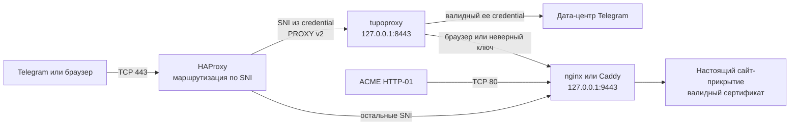

<p align="center">
  
</p>

<h1 align="center">tupoproxy</h1>

<p align="center">
  MTProto-прокси с выбираемыми TLS-профилями, изменяемой формой исходящего<br>
  трафика, настоящим HTTPS-прикрытием и аккуратной установкой рядом с<br>
  существующими сайтами и автоматическим выпуском сертификатов.
</p>

<p align="center">
  <a href="#быстрый-старт-одна-команда">Установка одной командой</a>
  ·
  <a href="deploy/README.md">Схема для сервера</a>
  ·
  <a href="docs/DPI_THREAT_MODEL.md">Модель угроз DPI</a>
</p>

<p align="center">
  
  
  
  
</p>

> [!IMPORTANT]
> Сервер может изменять только свою сторону FakeTLS-соединения. Входящий
> ClientHello создаёт приложение Telegram, поэтому прокси не может переписать
> его клиентский JA3/JA4. Современный DPI также умеет пересобирать TCP-поток.
> Проект не обещает обход абсолютно любой будущей блокировки, блокировки IP,
> «белого списка» или ограничений конкретного VPN.

## Что умеет tupoproxy

| Возможность | Как это работает |
|---|---|
| Стандартные ссылки Telegram | Используется совместимый credential `ee + secret + hex(SNI)` |
| Выбор TLS-профиля | SNI из credential выбирает `chrome`, `firefox`, `compat` или `legacy` |
| Настоящий TLS-образец | Прокси получает поведение реального домена и проверяет профиль дискового кэша |
| Изменяемая форма трафика | Границы исходящих TLS-record меняются по фазам и для каждого подключения |
| Защита от проб | Неверная авторизация уходит на настоящий HTTPS-сайт без баннера прокси |
| Совместный порт 443 | HAProxy разводит трафик по SNI, не забирая сайты у nginx/Caddy |
| Нормальный ACME | Автовыбор HTTP-01, nginx/Apache, webroot или DNS-01 без остановки чужого сервиса |
| Работа поверх VPN | Обычный TCP/443 без обязательной фильтрации по сети клиента |
| Опциональный Xray | Исходящее соединение к Telegram можно отправить в локальный SOCKS Xray |

## Рекомендуемая схема



HAProxy не расшифровывает TLS: он читает SNI и передаёт исходный поток дальше.
Существующие сайты продолжают работать через nginx/Caddy на локальном порту
`9443`. tupoproxy слушает только `127.0.0.1:8443`, поэтому не мешает другим
проектам и не забирает сертификаты.

## Быстрый старт: одна команда

Нужен сервер с Debian 12+/Ubuntu 22.04+ и домен с `A`/`AAAA`, указывающим на
сервер. Rust, Cargo и ручная установка пакетов не нужны.

Войдите на сервер как `root` и вставьте одну команду:

```bash
curl --fail --location --show-error https://github.com/wasteprince/tupoproxy/raw/refs/heads/main/install.sh | bash
```

Если вы вошли не как `root`, используйте одну команду с `sudo`:

```bash
curl --fail --location --show-error https://github.com/wasteprince/tupoproxy/raw/refs/heads/main/install.sh | sudo bash
```

Сразу после запуска мастер последовательно спросит:

1. Домен прокси.
2. E-mail для Let's Encrypt.
3. Публичный порт — можно нажать Enter для автоматического выбора.
4. TLS-фингерпринт — можно нажать Enter и оставить `chrome`.
5. Имя пользователя credential — можно нажать Enter и оставить `user`.

После ответов больше ничего делать не нужно. Установщик сам скачает готовый
бинарник, поставит зависимости, получит сертификат, создаст secret, настроит
cover-сайт, HAProxy, systemd и firewall, запустит всё и выведет готовую
Telegram-ссылку. Результат также сохранится в
`/etc/tupoproxy/INSTALLATION.txt`.

Если порт `443` занят, скрипт автоматически выберет первый свободный из `8443`,
`2053`, `2083`, `2087`, `2096`. Если занят порт выдачи сертификата, мастер
переключится на существующий nginx/Apache либо предложит DNS-проверку, не
останавливая чужой проект.

### Автоматическая установка без вопросов

Полностью неинтерактивный вариант:

```bash
curl --fail --location --show-error https://github.com/wasteprince/tupoproxy/raw/refs/heads/main/install.sh | sudo bash -s -- \
  --domain proxy.example.com --email admin@example.com --port 8443 --profile chrome
```

Скрипт сам:

- устанавливает системные зависимости через `apt`;
- скачивает статический `amd64`/`arm64` бинарник из последнего GitHub Release;
- проверяет SHA-256 перед установкой;
- выпускает или подключает сертификат;
- создаёт отдельные конфиги и systemd-сервисы tupoproxy, HAProxy и cover-nginx;
- не заменяет глобальные конфиги HAProxy/nginx и не занимает порты других
  проектов;
- генерирует secret, конфиг, Telegram-ссылку и сохраняет результат в
  `/etc/tupoproxy/INSTALLATION.txt` с правами `0600`.

### Если порт 80 или 443 уже занят

Порт прокси выбирается независимо от сертификата:

```bash
sudo bash install.sh --domain proxy.example.com --email admin@example.com --port 9443
```

В режиме `auto` установщик использует существующий nginx или Apache для
HTTP-01. Если `80` занят другим сервисом либо входящие `80/443` закрыты,
используйте DNS-01 — ему не нужен свободный порт на сервере.

Cloudflare с API Token, ограниченным правом `Zone:DNS:Edit` для нужной зоны:

```bash
read -r -s -p 'Cloudflare API token: ' TUPOPROXY_CLOUDFLARE_API_TOKEN; echo
sudo env TUPOPROXY_CLOUDFLARE_API_TOKEN="$TUPOPROXY_CLOUDFLARE_API_TOKEN" \
  bash install.sh --domain proxy.example.com --email admin@example.com \
  --port 9443 --acme-mode dns --dns-provider cloudflare
unset TUPOPROXY_CLOUDFLARE_API_TOKEN
```

Также поддерживаются пакетные плагины `digitalocean`, `dnsimple`, `dnsmadeeasy`,
`gehirn`, `google`, `linode`, `luadns`, `nsone`, `ovh`, `rfc2136` и `route53`.
Для большинства из них передайте подготовленный INI-файл:

```bash
sudo bash install.sh --domain proxy.example.com --email admin@example.com \
  --acme-mode dns --dns-provider digitalocean \
  --dns-credentials /root/digitalocean.ini
```

Если занятый порт 80 уже обслуживает challenge из известного каталога,
доступен режим без DNS API:

```bash
sudo bash install.sh --domain proxy.example.com --email admin@example.com \
  --acme-mode webroot --acme-webroot /var/www/example
```

Для любого DNS-провайдера без настроенного API доступен универсальный ручной
вариант: Certbot покажет одну TXT-запись, после её добавления установка
продолжится. Такой сертификат нельзя продлевать автоматически.

```bash
sudo bash install.sh --domain proxy.example.com --email admin@example.com \
  --port 9443 --acme-mode manual-dns
```

Если сертификат уже выпускает другой проект, передайте только пути — порт 80
вообще не проверяется:

```bash
sudo bash install.sh --domain proxy.example.com --port 9443 \
  --cert-fullchain /etc/letsencrypt/live/proxy.example.com/fullchain.pem \
  --cert-key /etc/letsencrypt/live/proxy.example.com/privkey.pem
```

### Только бинарник или сборка из исходников

Установить готовый бинарник без изменения серверной конфигурации:

```bash
curl -fsSL https://github.com/wasteprince/tupoproxy/raw/refs/heads/main/install.sh \
  | sudo bash -s -- --binary-only
tupoproxy --version
```

Архивы доступны на странице [GitHub Releases](https://github.com/wasteprince/tupoproxy/releases).
Релизы собираются статически под `x86_64-unknown-linux-musl` и
`aarch64-unknown-linux-musl`, поэтому один архив соответствующей архитектуры
работает и на Debian, и на Ubuntu. Для сборки текущего checkout вручную:

```bash
git clone https://github.com/wasteprince/tupoproxy.git
cd tupoproxy
./install-source.sh
```

### Ручная продакшен-схема

Если нужно делить один и тот же публичный `443` с несколькими существующими
сайтами по SNI, используйте
[продакшен-схему ниже](#установка-на-сервер-со-своим-доменом). Автоустановщик
бережно выбирает другой публичный порт, когда `443` уже занят.

## Установка на сервер со своим доменом

Пример ниже рассчитан на Debian/Ubuntu, nginx и systemd. Все значения
`example.com` обязательно заменяются:

Эта секция использует файлы из репозитория. Сначала перейдите в каталог
клонированного проекта — относительные пути `deploy/...` не существуют в
`/root` или домашнем каталоге сами по себе:

```bash
git clone https://github.com/wasteprince/tupoproxy.git
cd tupoproxy
```

| Назначение | Значение в примере |
|---|---|
| Публичный адрес ссылок | `proxy.example.com` |
| SNI профиля Chrome | `chrome.proxy.example.com` |
| SNI профиля Firefox | `firefox.proxy.example.com` |
| Публичный порт | `443` |
| Локальный порт tupoproxy | `127.0.0.1:8443` |
| Локальный HTTPS-сайт | `127.0.0.1:9443` |

Создайте DNS-записи `A`, а при наличии IPv6 — `AAAA`, для всех используемых
имён. Они должны указывать на один сервер. Сначала дождитесь обновления DNS.

### Установить HAProxy, nginx и Certbot

```bash
sudo apt install -y haproxy nginx certbot
sudo install -d -m 0755 /var/www/acme /var/www/tupoproxy-cover
```

Существующий виртуальный хост на порту `80` должен отдавать
`/.well-known/acme-challenge/` из `/var/www/acme`. После этого получите
сертификат:

```bash
sudo certbot certonly --webroot -w /var/www/acme \
  -d chrome.proxy.example.com \
  -d firefox.proxy.example.com
```

Адаптируйте [`deploy/nginx-cover.conf.example`](deploy/nginx-cover.conf.example)
под путь сертификата, который показал Certbot. Существующие HTTPS-виртуальные
хосты перенесите с публичного `:443` на `127.0.0.1:9443`. Не заменяйте рабочий
конфиг nginx целиком — добавьте нужные блоки в вашу текущую схему.

### Подготовить конфигурацию tupoproxy

```bash
sudo groupadd --system tupoproxy 2>/dev/null || true
sudo useradd --system --gid tupoproxy --home /var/lib/tupoproxy \
  --shell /usr/sbin/nologin tupoproxy 2>/dev/null || true
sudo install -d -o tupoproxy -g tupoproxy -m 0750 /var/lib/tupoproxy
sudo install -d -o root -g tupoproxy -m 0750 /etc/tupoproxy
sudo install -m 0640 -o root -g tupoproxy \
  deploy/tupoproxy.toml.example /etc/tupoproxy/config.toml
openssl rand -hex 16
```

Откройте `/etc/tupoproxy/config.toml` и замените:

1. Все домены `example.com` на собственные.
2. Нулевой секрет на результат `openssl rand -hex 16`.
3. `public_host` на имя, которое должно быть в Telegram-ссылке.
4. Набор `tls_fingerprints` на нужные профили.

Секрет — ровно 32 шестнадцатеричных символа. Пример уже ограничивает слушатель
адресом loopback, доверяет PROXY v2 только от loopback, направляет пробы на
настоящий TLS-порт `9443` и не публикует management API в интернет.

### Установить systemd-сервис

```bash
sudo install -m 0644 deploy/tupoproxy.service.example \
  /etc/systemd/system/tupoproxy.service
sudo systemctl daemon-reload
sudo systemctl enable --now tupoproxy
sudo systemctl status tupoproxy --no-pager
```

### Передать публичный 443 HAProxy

Добавьте содержимое
[`deploy/haproxy.cfg.example`](deploy/haproxy.cfg.example) в рабочий конфиг
HAProxy и замените домены. Проверьте конфиги до перезапуска:

```bash
sudo nginx -t
sudo haproxy -c -f /etc/haproxy/haproxy.cfg
sudo systemctl reload nginx
sudo systemctl enable --now haproxy
```

Если nginx всё ещё слушает `0.0.0.0:443` или `[::]:443`, HAProxy не запустится.
После переноса у nginx должен остаться только локальный TLS-порт `9443`.
Публичный порт `80` продолжает обслуживать ACME и не затрагивается прокси.

### Проверить установку

```bash
sudo -u tupoproxy /usr/local/bin/tupoproxy \
  healthcheck /etc/tupoproxy/config.toml --mode ready

openssl s_client -connect IP_СЕРВЕРА:443 \
  -servername chrome.proxy.example.com </dev/null

curl --resolve chrome.proxy.example.com:443:IP_СЕРВЕРА \
  https://chrome.proxy.example.com/

sudo journalctl -u tupoproxy -n 100 --no-pager
```

В браузерной проверке должен открываться настоящий сайт-прикрытие с валидным
сертификатом. Ссылки для Telegram выводятся в журнал при запуске.

## Выбор TLS-фингерпринта через credential

```toml
[censorship]
tls_domain = "chrome.proxy.example.com"
tls_fingerprints = {
  "chrome.proxy.example.com" = "chrome",
  "firefox.proxy.example.com" = "firefox",
  "safe.proxy.example.com" = "compat"
}
```

| Профиль | Для чего нужен |
|---|---|
| `chrome` | Основной современный профиль и Chrome-подобные фазы TLS-record |
| `firefox` | Отдельный Firefox-профиль получения TLS и формы ответа |
| `compat` | Более консервативные размеры для VPN, прокси и уменьшенного MTU |
| `legacy` | Старое поведение с крупными фиксированными record для проверки совместимости |

Формат credential остаётся стандартным:

```text
ee + 16-байтовый secret + hex(SNI)
```

Например, SNI `firefox.proxy.example.com` выбирает `firefox`. Дополнительные
нестандартные байты не добавляются. Выбор влияет на серверный образец TLS и
исходящие record, но не меняет ClientHello, созданный приложением Telegram.

## Дробление пакетов и сходство с XHTTP

tupoproxy меняет границы исходящих TLS-record в несколько фаз и использует
новую серверную случайность для каждого подключения. Это убирает один
постоянный шаблон ответа и лучше переносит уменьшенный MTU VPN-туннелей.

Это не буквальный XHTTP. Настоящий XHTTP — согласованный HTTP-транспорт, который
должны понимать обе стороны; стандартный клиент Telegram его не реализует.
Можно направить только исходящую сторону «сервер → Telegram» через локальный
SOCKS Xray: пример закомментирован в
[`deploy/tupoproxy.toml.example`](deploy/tupoproxy.toml.example).

## Работа при включённом VPN на телефоне

Специальная настройка сервера не требуется: подключение идёт по обычному
TCP/443 и обычно проходит внутри VPN-туннеля. Если без VPN всё работает, а с VPN
нет, проверьте в приложении VPN:

- kill switch и правила запрета неизвестных адресов;
- раздельную маршрутизацию приложений;
- исключён ли Telegram из проксируемых приложений;
- фильтрацию частного DNS, домена или IP сервера;
- MTU туннеля.

Сервер не может отменить политику чужого VPN. Для пути с небольшим MTU можно
проверить профиль `compat`, но он не поможет, если VPN полностью блокирует адрес.

## Docker

Образ собирается только из текущего исходного дерева:

```bash
docker compose build tupoproxy
docker compose up -d tupoproxy
docker compose logs -f tupoproxy
```

До запуска замените заглушки в `config.toml`. Обычный Compose публикует порт
`443` напрямую. Если на хосте уже есть nginx/Caddy и HAProxy, нативная установка
через systemd проще; контейнерную сеть и доверенные адреса PROXY protocol нужно
настроить под собственную топологию.

## Управление и обновление

```bash
# Статус и журнал
sudo systemctl status tupoproxy --no-pager
sudo journalctl -u tupoproxy -f

# Проверка готовности
sudo -u tupoproxy tupoproxy healthcheck \
  /etc/tupoproxy/config.toml --mode ready

# Применить параметры, поддерживающие hot reload
sudo systemctl reload tupoproxy

# Обновить бинарник из последнего GitHub Release
sudo bash install.sh --binary-only
sudo systemctl restart tupoproxy

# Либо пересобрать обновлённый checkout
git pull --ff-only
./install-source.sh
sudo systemctl restart tupoproxy
```

Control API в продакшен-примере доступен только локально. Для него есть клиент
[`tools/tupoproxy_api.py`](tools/tupoproxy_api.py). Метрики Prometheus используют
префикс `tupoproxy_*`; готовые Grafana- и Zabbix-файлы лежат в `tools/`.

## Если что-то не работает

| Симптом | Что проверить |
|---|---|
| HAProxy не может занять `:443` | Уберите публичный `:443` у nginx/Caddy, оставив `127.0.0.1:9443` |
| В браузере нет сайта-прикрытия | ACL по SNI в HAProxy и TLS на `127.0.0.1:9443` |
| Не продлевается сертификат | Для HTTP-01 проверьте порт `80`; при занятом/закрытом порте переключитесь на DNS-плагин |
| Telegram отвергает ссылку | Проверьте `ee`, 32 hex-символа секрета и точный hex(SNI) |
| Не работает один профиль | DNS, SAN сертификата и журнал загрузки TLS-профиля этого SNI |
| В логах нет реального IP | HAProxy должен отправлять PROXY v2, доверен только loopback |
| Ошибка только с VPN | Маршрутизация приложений, kill switch, DNS-фильтр и MTU VPN |
| Readiness не проходит | `journalctl -u tupoproxy` и исходящее соединение к Telegram |

## Честные ограничения

- FakeTLS — маскировка, а не замена шифрования MTProto.
- Серверная форма record не меняет клиентский JA3/JA4.
- Одно лишь TCP-дробление ненадёжно против DPI с пересборкой потока.
- Настоящий сайт-прикрытие делает ответ на пробы правдоподобнее, но не защищает
  от блокировки IP или SNI.
- Несколько профилей дают оператору выбор, но не гарантируют вечную
  неотличимость трафика.

Источники, наблюдения и границы реализации собраны в
[`docs/DPI_THREAT_MODEL.md`](docs/DPI_THREAT_MODEL.md).

## Документация

| Файл | Содержание |
|---|---|
| [`deploy/README.md`](deploy/README.md) | Детали общей схемы `443` и ACME |
| [`docs/DPI_THREAT_MODEL.md`](docs/DPI_THREAT_MODEL.md) | Исследование способов обнаружения и ограничения решения |
| [`docs/Config_params/CONFIG_PARAMS.ru.md`](docs/Config_params/CONFIG_PARAMS.ru.md) | Полный справочник параметров на русском |
| [`docs/Config_params/CONFIG_PARAMS.en.md`](docs/Config_params/CONFIG_PARAMS.en.md) | Полный справочник параметров на английском |

## Проверка исходного кода

```bash
cargo check --locked --all-targets
cargo test --locked fingerprint
cargo test --locked selected_record_profiles_have_distinct_bounded_phases
git diff --check
```

Правила участия находятся в [`CONTRIBUTING.md`](CONTRIBUTING.md).

## Лицензия и происхождение

tupoproxy — независимая модификация исходного кода Telemt 3.5.0 и не является
официальным релизом исходного проекта. Обязательные авторские уведомления и
текст TELEMT PL 3 сохранены в [`LICENSE`](LICENSE) и
[`LICENSING.md`](LICENSING.md). Баннер с енотом создан специально для этого
форка.
