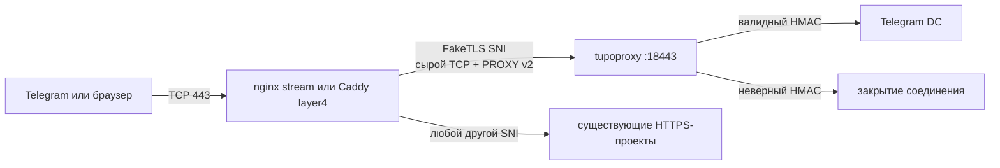

<p align="center">
  
</p>

<h1 align="center">tupoproxy</h1>

<p align="center">
  MTProto FakeTLS-прокси с HMAC-аутентификацией<br>
  и безопасным совместным использованием TCP/443 с nginx или Caddy.
</p>

<p align="center">
  <a href="#быстрый-старт">Быстрый старт</a> ·
  <a href="#как-это-работает">Архитектура</a> ·
  <a href="#диагностика">Диагностика</a> ·
  <a href="docs/DPI_THREAT_MODEL.md">Модель угроз</a>
</p>

<p align="center">
  
  
  
  
</p>

> [!IMPORTANT]
> Ни один прокси не гарантирует обход всех существующих и будущих блокировок.
> Адресная блокировка IP, правила мобильного оператора, VPN и изменения клиента
> Telegram находятся вне контроля сервера.

## Главное

| Возможность | Реализация |
|---|---|
| FakeTLS как у проверенного рабочего прокси | `ee` credential, HMAC-SHA256 и SNI-домен |
| Публичный порт | Всегда TCP/443 через существующий reverse proxy |
| Другие проекты | Продолжают обслуживаться тем же nginx/Caddy |
| Неверный credential | Соединение закрывается без сертификата и HTTPS fallback |
| Современный ServerHello | TLS 1.3, совместимый cipher и предложенный клиентом key share |
| Переменные TLS-записи | Размер FakeTLS Application Data меняется между соединениями |
| Адрес клиента | Edge передаёт его через PROXY protocol v2 |
| Telegram-ссылка | Binary Base64URL credential, как в проверенной ссылке |
| Платформы | Статические бинарники для Debian/Ubuntu `amd64` и `arm64` |

## Как это работает



Reverse proxy выполняет только L4-маршрутизацию:

1. Получает TCP-соединение на `443`.
2. Читает SNI из исходного ClientHello.
3. Для выделенного FakeTLS-домена передаёт исходные байты tupoproxy.
4. Для остальных доменов продолжает обычную TLS-обработку сайтов.

На FakeTLS-маршруте nginx/Caddy не завершает TLS, не подставляет сертификат и
не создаёт второй ClientHello. Внешний поток остаётся таким же, как при прямом
подключении к прокси; PROXY v2 существует только на внутреннем участке между
edge и tupoproxy.

### FakeTLS handshake

Telegram формирует ClientHello с SNI и 32-байтным полем аутентификации:

```text
HMAC-SHA256(16-byte secret, ClientHello with zeroed random) + timestamp
```

Если HMAC корректен, tupoproxy отвечает TLS 1.3-похожим ServerHello, отражает
Session ID, выбирает cipher/key share из предложенных клиентом и подписывает
весь первый server flight ответным HMAC. Дальнейший MTProto-трафик передаётся
в TLS Application Data-подобных записях.

Неверный HMAC, неизвестный SNI и активный TLS-сканер получают закрытие
соединения. Сертификат для FakeTLS-домена не выпускается и не требуется.

## Быстрый старт

### Требования

- Debian 12+ или Ubuntu 22.04+;
- `root` либо `sudo`;
- существующий HTTPS-домен, уже обслуживаемый reverse proxy;
- отдельный FakeTLS-домен;
- основной домен должен иметь одну прямую A-запись на IPv4 сервера;
- FakeTLS-домен должен существовать, но может указывать на этот или другой сервер;
- публичный TCP/443 должен принадлежать совместимому nginx/Caddy.

Cloudflare можно использовать как DNS, но A-запись основного домена должна
напрямую указывать на IPv4 сервера. Обычный Cloudflare HTTP proxy не передаёт
сырой MTProxy-поток и не подходит для основного домена из Telegram-ссылки.

### Одна команда

Под `root`:

```bash
curl -fL https://github.com/wasteprince/tupoproxy/releases/latest/download/install.sh | bash
```

С `sudo`:

```bash
curl -fL https://github.com/wasteprince/tupoproxy/releases/latest/download/install.sh | sudo bash
```

Мастер запросит:

1. Любой существующий HTTPS-домен на этом reverse proxy.
2. Отдельный существующий домен для FakeTLS SNI.
3. Серверный TLS-профиль.
4. Имя Telegram credential.
5. При желании рекламный tag из `@MTProxybot`.

Порты, сертификаты, Certbot и ручные конфиги спрашивать не требуется.

Установщик автоматически:

1. Скачивает статический бинарник нужной архитектуры.
2. Проверяет SHA-256 бинарника и вспомогательных скриптов.
3. Находит владельца публичного TCP/443.
4. Добавляет только сырой FakeTLS SNI-маршрут.
5. Проверяет конфигурацию и reload существующего edge.
6. Выполняет настоящий HMAC-аутентифицированный FakeTLS probe.
7. Показывает secret для `@MTProxybot` и готовую Telegram-ссылку.

Результат сохраняется с правами `0600`:

```text
/etc/tupoproxy/INSTALLATION.txt
```

### Неинтерактивная установка

```bash
curl -fL https://github.com/wasteprince/tupoproxy/releases/latest/download/install.sh \
  | sudo bash -s -- \
      --domain site.example.com \
      --tls-domain proxy.example.com \
      --profile chrome \
      --user user
```

Можно передать существующий секрет или рекламный tag:

```bash
--secret 00112233445566778899aabbccddeeff
--ad-tag 0123456789abcdef0123456789abcdef
```

## Домены и DNS

Пример:

```text
site.example.com   A   203.0.113.10
proxy.example.com  A   198.51.100.20  # либо тот же 203.0.113.10
```

`site.example.com` используется в поле `server` Telegram-ссылки и остаётся
обычным сайтом. Его единственная A-запись должна напрямую указывать на этот VPS.
`proxy.example.com` используется как SNI внутри FakeTLS credential. DNS-адрес
FakeTLS-домена может отличаться: локальный edge маршрутизирует его по SNI.

Telegram-ссылка использует первый домен, введённый при установке:

```text
tg://proxy?server=site.example.com&port=443&secret=<Base64URL credential>
```

После Base64URL-декодирования credential имеет структуру:

```text
0xee | 16-byte secret | proxy.example.com
```

Для регистрации в `@MTProxybot` отправляется только обычный 32-символьный
hex-secret — без `ee`, Base64URL и домена.

## Reverse proxy

Поддерживаемые варианты:

| Edge | Действие установщика |
|---|---|
| Host nginx со `stream_ssl_preread` | Добавляет stream map и переносит существующие HTTPS listeners на локальный порт |
| Docker nginx со `stream_ssl_preread` | Изменяет постоянный bind/volume config и делает reload контейнера |
| Host Caddy с caddy-l4 | Добавляет listener wrapper в активный Caddyfile |
| Docker Caddy с caddy-l4 | Изменяет постоянный Caddyfile и делает reload |
| Docker Caddy без caddy-l4 | Сохраняет исходный бинарник, добавляет модуль и перезапускает контейнер |
| TCP/443 свободен | Загружает готовый Caddy с caddy-l4 из GHCR и создаёт контейнер с конфигурацией в `/opt/caddy` |

Read-only bind mounts поддерживаются. Интегратор находит источник mount на
хосте, изменяет существующий файл на месте, сохраняет его inode и выполняет
откат при ошибке. Режим mount и соседние файлы не меняются.

Обычный HTTP `reverse_proxy` для FakeTLS не подходит: он завершает TLS и
разрушает HMAC ClientHello. Необходим Caddy layer4 или nginx stream с
`ssl_preread`.

Установщик не удаляет reverse proxy, его контейнер, `/opt/caddy`, Docker,
firewall или конфигурацию чужих сайтов.

Управляемый Caddy не компилируется на сервере. Установщик загружает готовый
образ `ghcr.io/wasteprince/tupoproxy-caddy-l4:v3.8.2` для `amd64` или `arm64`
вместе с релизом tupoproxy.

## TLS-профили

Доступные значения:

| Профиль | Назначение |
|---|---|
| `chrome` | Современная Chrome/BoringSSL-подобная форма ответа |
| `firefox` | Firefox-подобные границы TLS-записей |
| `compat` | Более консервативная совместимость |
| `legacy` | Старые клиенты и сети |

Профиль влияет на серверный ответ и последующие TLS-записи. Входящий
ClientHello, JA3/JA4 и TCP-параметры создаются Telegram и операционной системой
телефона; сервер не может переписать их до получения соединения.

## Обновление

Повторно выполните ту же команду:

```bash
curl -fL https://github.com/wasteprince/tupoproxy/releases/latest/download/install.sh | sudo bash
```

Сохранённые домены, secret, пользователь, профиль и рекламный tag подхватятся
из `INSTALLATION.txt`. Маршрут edge будет применён повторно с проверкой и
возможностью отката.

## Удаление

```bash
curl -fL https://github.com/wasteprince/tupoproxy/releases/latest/download/uninstall.sh | sudo bash
```

Для неинтерактивного удаления:

```bash
curl -fL https://github.com/wasteprince/tupoproxy/releases/latest/download/uninstall.sh \
  | sudo bash -s -- --yes
```

Удаление убирает маршрут FakeTLS, сервис, бинарник, secret и приватное
состояние. Reverse proxy, его контейнер, `/opt/caddy`, другие сайты,
сертификаты, firewall и общие системные пакеты сохраняются.

## Диагностика

```bash
sudo systemctl status tupoproxy --no-pager -l
sudo journalctl -u tupoproxy -n 150 --no-pager
sudo ss -ltnp 'sport = :443'
sudo cat /etc/tupoproxy/INSTALLATION.txt
```

Проверка FakeTLS HMAC через публичный edge:

```bash
sudo /usr/local/lib/tupoproxy/fake-tls-probe.py \
  --connect site.example.com:443 \
  --sni proxy.example.com \
  --secret 00112233445566778899aabbccddeeff
```

| Ошибка | Причина |
|---|---|
| `must have exactly one direct IPv4 A record` | Основной домен не указывает прямо на единственный IPv4 VPS либо включён CDN proxy |
| `owned by an incompatible service` | TCP/443 занят неизвестным или неподдерживаемым edge |
| `configuration is not stored in a persistent mount` | Docker-конфиг находится только во writable layer |
| `cannot update ... in container` | Mount недоступен через Docker и не найден его host source |
| `authenticated FakeTLS did not pass` | SNI-маршрут не дошёл до tupoproxy или secret/config не совпали |

## Файлы установки

| Назначение | Путь |
|---|---|
| Бинарник | `/usr/local/bin/tupoproxy` |
| Основной конфиг | `/etc/tupoproxy/config.toml` |
| Итог установки | `/etc/tupoproxy/INSTALLATION.txt` |
| Edge-интегратор | `/usr/local/lib/tupoproxy/edge-integration.py` |
| FakeTLS probe | `/usr/local/lib/tupoproxy/fake-tls-probe.py` |
| Проверенный runtime установщика | `/usr/local/lib/tupoproxy/install-runtime.sh` |
| Состояние | `/var/lib/tupoproxy` |
| systemd unit | `/etc/systemd/system/tupoproxy.service` |

## Ограничения

- Рабочий сегодня IP может быть заблокирован завтра.
- Сервер не способен изменить уже отправленный Telegram ClientHello.
- TCP-сегментация не является гарантией обхода stateful DPI.
- VPN на телефоне может менять маршрут, MTU, DNS и доступность IP.
- FakeTLS HMAC маскирует протокол, но не превращает MTProto в XHTTP.

## Лицензия

Проект распространяется по лицензии из [LICENSE](LICENSE). Дополнительная
информация о происхождении и совместимых условиях находится в
[LICENSING.md](LICENSING.md).
